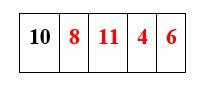

# 1.1 Insertion Sort

Insertion sort belongs to comparison-based sorting algorithms. Insertion sort is a sorting algorithm that is quite similar to the selection sort algorithm. In the insertion sort algorithm all the elements, choosing one element in each iteration, are transferred to the right position which results in a growing sorted list. In simple words, we can say that in insertions sort at each iteration, it removes one element from the provided input data, and by comparison, it finds the right location of that element in the sorted list and inserts it there. It repeats until no input elements remain. In simple words, we can say that algorithm of insertion helps us to build a final sorted list with the movement of higher-ranked elements.

In the best case, the running time for insertion sort is linear running time O(n) as the input array is already sorted in the best case. For the worst case, as we know the input array will be in reverse order and we will need to iterate through the whole unsorted array to the end to find the right element, so the running time will be O(n^2). For the average case, the running time is also O(n^2).

### How it works:

In insertion sort, at the start of the algorithm, the first element in the array is considered as sorted even if the array is unsorted. Then every single element of the array is checked with the previous elements which are in sorted order and this results in a growing sorted array. In each iteration, an element is removed from the unsorted array and then after comparisons in the sorted array, placed at the right location. The iteration in the array continues until we get a sorted array. The correctness of this algorithm is that after k iteration the array is sorted by k+1 elements.

## 1.1.1 Pseudo Code

### Input:

Insertion sort will take an array of elements A that can be sorted in the best case or in reverse order in the worst case.

### Output:

This algorithm will return the original array of elements Arr but this time all the elements in the array Arr will be in sorted order.

```
INSERTION-SORT ( Arr )
for j = 2 to Arr.length
	keyValue  = Arr[j]
	i = j - 1
	While i > 0 and Arr[i] > keyValue
		Arr[i + 1] = Arr[i]
		i = i - 1
	Arr[i + 1] = keyValue
return Arr
```

## 1.1.2 Time Complexity Analysis

Insertion sort’s time complexity is T(n) = O(n2). We are going to calculate it by Big O Asymptotic Line by Line.


Insertion sort has O(n^2) worst case time complexity. It takes same time for average-case as it takes for worst-case. For best case it takes linear-time i.e. n

## 1.1.3 Dry Run

Assume that A is an array of unsorted elements.



In A, we have all the elements placed in random order. We begin by assuming that a list with A[0] element, which is 5 in the above list, is sorted. Now we will loop for j = 1 through the whole loop and find the element as 8 is smaller than 10, move 10 and insert 8 before it.


now for j = 2
now all elements are smaller than 11 in A[0… j-1]


Now for j = 3
Elements are greater than the key = 4 so move it to 0th index and move all the elements in A[0...j - 1] one index ahead.


Now for j = 4
6 will be placed at the 1st index in the array A and all the elements after it are moved one place ahead.


Now for j = 5 the condition in for loop becomes false and insertion sort will terminate.
We have a sorted array at the end.


## 1.1.4 Pros

Insertion sort has the following advantages:

- It is very efficient on smaller data sets.
- It is stable as it does not change the index order of elements.
- It does not require auxiliary storage i.e. requires only a constant amount of additional memory space O(1).
- For an almost sorted data set, it’s incredibly efficient i.e O(n).
- It can be used in other sorting algorithms to sort smaller lists i.e it is used to sort the lists in bucket sort.

## 1.1.5 Cons

Insertion sort has the following weakness:

- Its performance is not as good as it is compared to the performance of other better sorting algorithms.
- It takes a greater number of element shifts.
- When dealing with larger data sets, it becomes less efficient.
- It is only useful when the list contains only a few elements.
