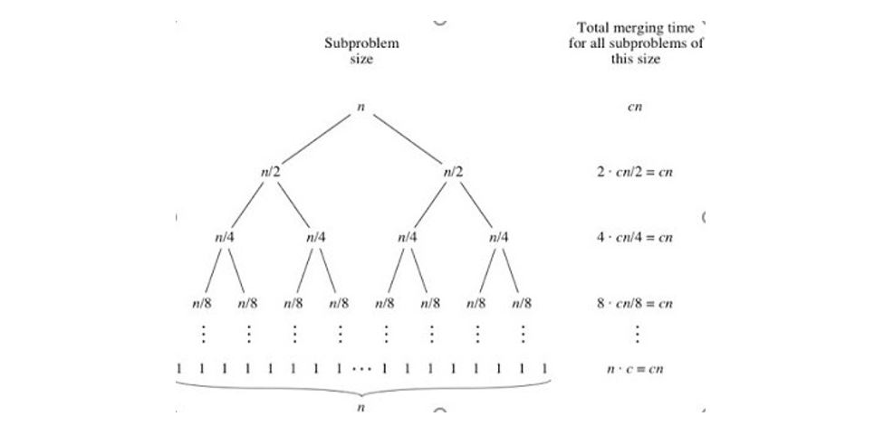
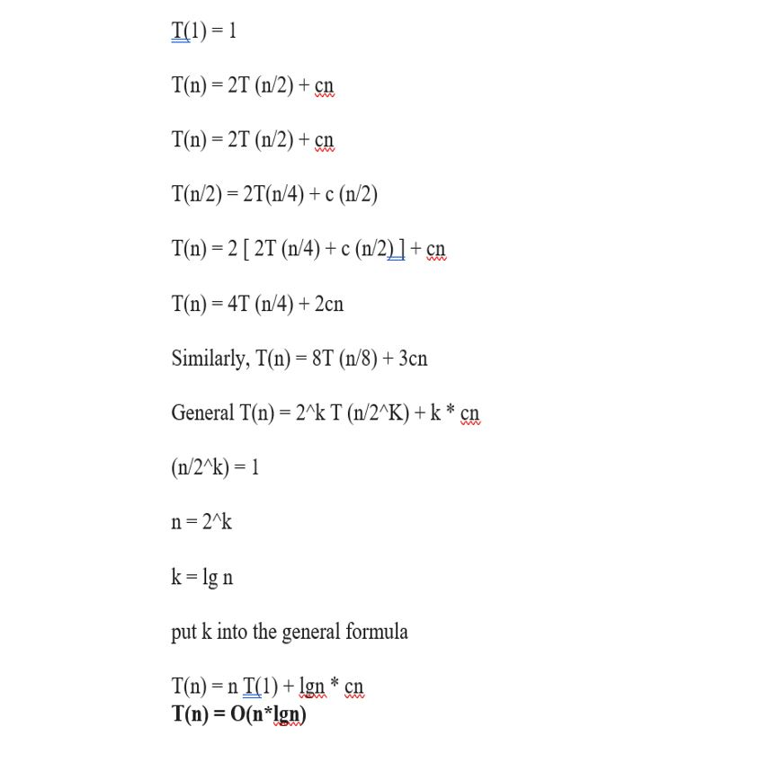
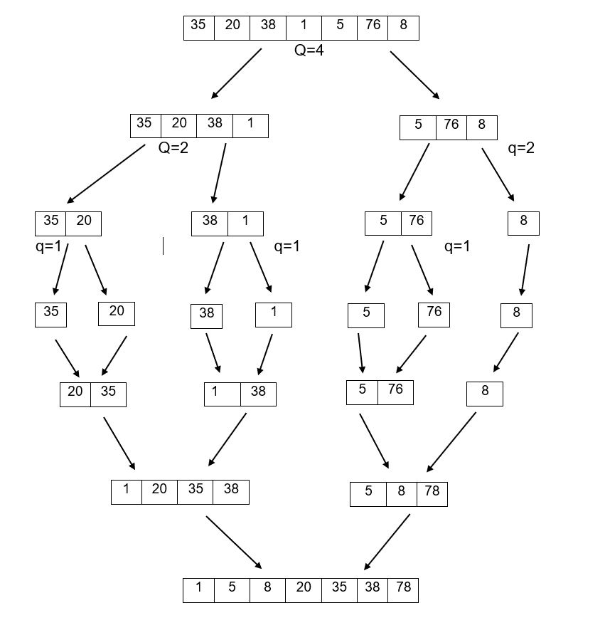

# 1.4 Merge Sort

Merge sort is an efficient and very popular sorting algorithm. This algorithm belongs to comparison-based sorting algorithm model. Basically it uses a divide-conquer technique which is the breakage of a list into several small sub-lists and repeating it until each sublist becomes a single element list and then merging them in such a way that the solution we get after merging these sublists is a sorted solution.
The divide-conquer approach works in the following manner:

- Divide the given problem into small sub problems.
- Solve each sub problem.
- Merge all the solved subproblems.

This algorithm works by dividing the unsorted list of n elements into n sublists in which each sublist will contain 1 element. Then adjacent pairs of two sublists is taken and Merge function is called to merge them to form a list of 2 elements and after this step, we will have n/2 no of sub-lists and the size of each sublist will consist of two elements. Repeat the above process until we get a single list that will be sorted.
In the comparison of two sublists, the first element from both the sub-lists is taken. If the sorting is in increasing order then the element that is smaller in value is placed in the list. This process is repeated until both the sublists are empty and all the elements of these two sub-lists are placed in the new sublist which is sorted. Merge function returns the sorted merge sublist.

## 1.4.1 Pseudo Code

```
Merge-Sort ( Arr, startPoint, endPoint)
	If startPoint,  < endPoint
		midPoint = floor((startPoint, + endPoint ) / 2)
		Merge-Sort(Arr, startPoint, midPoint)
		Merge-Sort(Arr, midPoint +1, endPoint)
		Merge(Arr, startPoint, midPoint, endPoint)

Merge(Arr, startPoint, midPoint, endPoint)
	n1 = midPoint - startPoint,  + 1
	n2 = endPoint - midPoint
	let Left[1…….n1 + 1] and Right[1…….n2 + 1] be arrays
	for i = 1 to n1
        Left[i] = Arr[startPoint + i - 1]
	for j = 1 to n2
        Right[j] = Arr[midPoint + j]
    Left[n1 + 1] = infinity
    Right[n2 + 1] = infinity
    i = 1
    j = 1
    for k = startPoint,  to r
        if Left[i] =< Right[j]
	        Arr[k] = Left[i]
	        i = i + 1
        else
	        Arr[k] = Right[j]
	        j = j + 1
    return A

```

## 1.4.2 Complexity-Analysis

Merge sort has runningof T(n) = Θ(n lg n). We will calculate it by using Recursion Tree.



T(n) = O(n log n )
As we have n elements and in each step elements are divided by half until we reach a position where each leaf node of the tree have exactly one element. We know that
HeightOfTree = log (n)
TotalLevels = log(n) + 1
With each-level cost of solving the problem is c _ n. Total running cost is sum of running costs of each level of the tree.
C _ n _ log n + c _ n.
As low-order terms of c\*n and constant coefficient c are being, and we have,
O(n lg n)
We can also prove it by following method



## 1.4.3 Dry run



## 1.4.4 Pros

- It is faster and efficient for bigger data sets because it does not need to iterate through the whole list every time.
- For a bigger data set, it is faster than the heap sort.
- It is stable as order of elements in the sorted list is the same as it was in the unsorted list.
- For linked lists, it is considered as best sorting technique.

## 1.4.5 Cons

- Due to the second array, it takes twice the memory of the heap sort.
- It uses additional memory space as elements of the sub arrays needed to be stored.
- It will complete all the steps even if the array is sorted.
- It is slower for smaller data sets in comparison to other sorting algorithms.
- It doesn't sort the elements if it exceeds to certain limits.(say 100000 elements).
