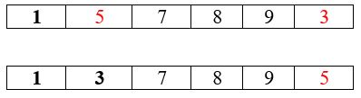

# 1.1 Selection Sort

The selection sort is a sorting-algorithm that belongs to a comparison-based sorting algorithms model. In selection sort, smallest element or highest element in the unsorted array is searched and swap it with element at first index of the sorted array. then next greatest or smallest element is searched in unsorted array and exchanged with the element in the 2nd position in the sorted array. As a result, the elements which are sorted being placed at the start of the array and the rest will remain unsorted. This process is repeated till we get a sorted array and no element has remained in the unsorted part. It is known as selection sort as it works by selecting the next smallest or largest element and exchanging onto the right place. It is also an in-place sorting algorithm as it does not take any extra memory space.

### How does it work?

Selection sort works according to the following steps:

1. In this algorithm, start by choosing first element as key and search for next smallest item in the given array and if the smallest number isn’t found then do anything and if found then swap it with item placed at the first index of array.
2. Then second item is selected and looked for the next smallest item in the array and if found it is exchanged with the 2nd item.
3. These steps are repeated until we have all the elements in the sorted order.

## 1.1.1 Pseudo Code

### Input:

An array A consisting of n unsorted elements.

### Output:

Original array A but in a sorted manner.

```
SELECTION-SORT( inputArray )
n = inputArray.length
for a = 1 to n - 1
    		minimumValue = a
    		for b = a + 1 to n
        			if inputArray[b] < inputArray[minimumValue] then
            			minimumValue = b
    		exchange(inputArray[a], inputArray[minimumValue])
```

## 1.1.2 Complexity


1.1.3 Dry Run
Let’s say we have an array A of unsorted elements.


At i = 0, select first element and compare it with the all elements of array A[1….n] to get the smallest element. If smallest element is found swap it with currently selected element.


At i = 1 we have A[0…i-1] array sorted.
Find second smallest element



At i = 2 we have A[0….i – 1] array sorted
Find third smallest element in the sub array


At i = 3 we have A[0….i – 1] array sorted
Find fourth smallest element in the sub array


At i = 4 we have A[0….i – 1] array sorted
Find fourth fifth element in the sub array


Hence we have a sorted array at the end of insertion sort
At i = 3 we have A[0….i – 1] array sorted
Find fourth smallest element in the sub array


## 1.1.4 Pros

- It works really well on smaller data sets.
- It is efficient and easy to implement.
- No additional temp memory is required in this.

## 1.1.5 Cons

- It is not suitable for larger data sets.
- It might change the order of two same elements so it is unstable.
- When making comparisons in unsorted arrays, it requires O(n^2) which is ideal where n is small but not ideal when n is very big.
